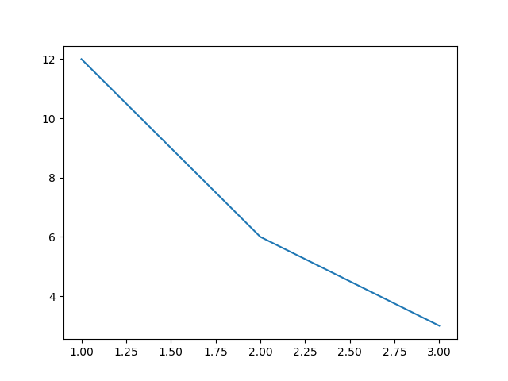
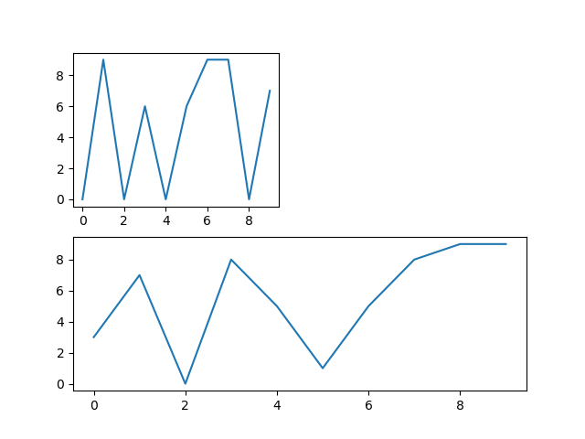

# Matplotlib-Testing
Following some tutorials and trying to create an infographic.

* [sentdex tutorial series](https://pythonprogramming.net/matplotlib-intro-tutorial/)
* [Corey Schafer tutorial series](https://www.youtube.com/watch?v=UO98lJQ3QGI&list=PL-osiE80TeTvipOqomVEeZ1HRrcEvtZB_)
* [Cartopy tutorial](https://www.youtube.com/watch?v=WwdmGw4Lca0)

## line.py output

## legends titles and labels.py output

## bar charts and histograms.py output

## subplots.py output

## pie chart.py output

## live graphs.py output

## geographic plotting.py output

## bci_infographic_update.py output
Visualizing data from [the bci wiki](https://bciwiki.org/index.php/Category:Companies) company list. this is a WIP

